# -clt-bank-transfer
Test Developer Backend - Transferencia bancarias 

Para probar se puede de 2 formas con docker o levantando el proyecto localmente con dotnet

### Docker ###
Docker Comandos (Estando la terminal en el proyecto ejecutar el docker): 

docker compose up --build    (para subir el proyecto)

docker compose down -v       (para resetear todo)

### Dotnet ### 
Dotnet Comandos (Abrir la terminal dentro del proyecto):

dotnet clean 

dotnet build

dotnet run --project src/BankTransfer.Api

## Base de datos (SQLite) ## 

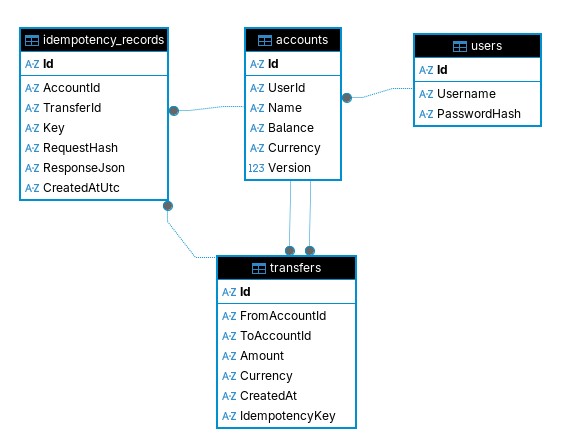

## Architecture ##

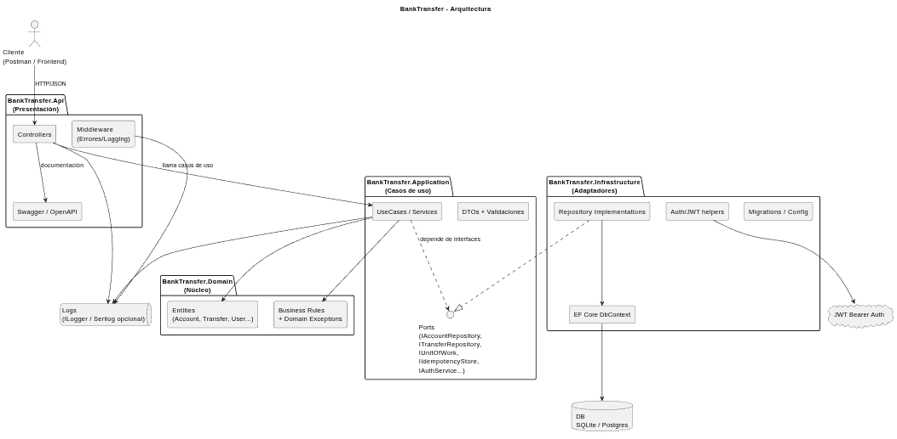

### Datos para probar ###

Cuentas Id que tenemos de prueba :

            Ids                         Name    balance Currency
AAAAAAAA-AAAA-AAAA-AAAA-AAAAAAAAAAAA	Luana	1000.0	PYG

BBBBBBBB-BBBB-BBBB-BBBB-BBBBBBBBBBBB	Luana	200.0	USD

CCCCCCCC-CCCC-CCCC-CCCC-CCCCCCCCCCCC	Jose	500.0	PYG

DDDDDDDD-DDDD-DDDD-DDDD-DDDDDDDDDDDD	Takashi	250.0	PYG

EEEEEEEE-EEEE-EEEE-EEEE-EEEEEEEEEEEE	Takashi	50.0	USD

### Usuarios de pruebas: ###

{

  "username": "takashi",

  "password": "takashi123"

}

{
  "username": "luana",

  "password": "luana123"

}

{

  "username": "jose",

  "password": "jose123"
  
}

### -------------- SWAGGER ------------------------- ###

### ############### Paso 1 ################ ###

Generar el token del usuario a registrar.

Body Request: 

{

  "username": "takashi",

  "password": "takashi123"

}

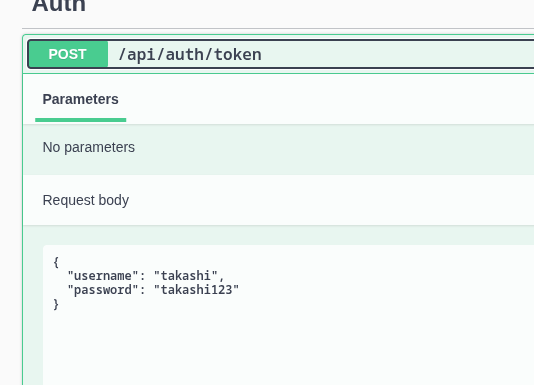

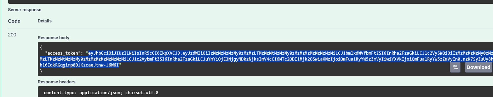

Obtenemos le token, copiamos y pegamos en Authorize

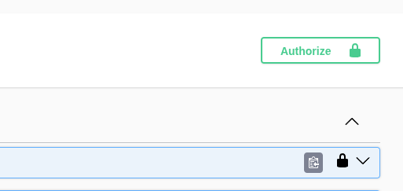

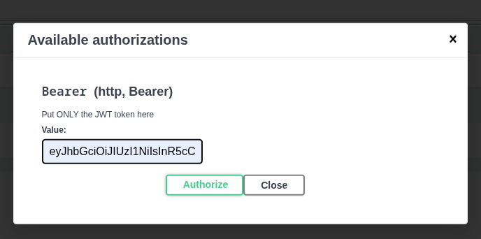

Y una vez esto podemos probar el api. 

### ############### Transferencia ####################### ####

## Flujo Transferencia ##

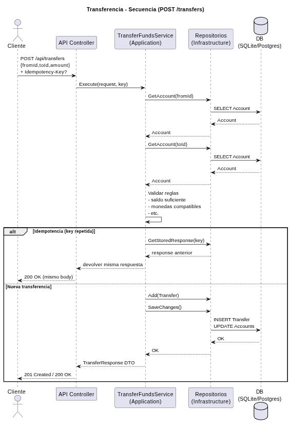

Para Realizar Transferencia 

## OJO ###
Idempotency key para iniciar con las transferencias: 

10f85f92-6698-4c31-9679-15f20fac6594

Cada transferencia se debe ir cambiando Idempotency-key se puede ir cambiando el numero final aumentando para las pruebas. 

Ejemplo:

10f85f92-6698-4c31-9679-15f20fac6595

10f85f92-6698-4c31-9679-15f20fac6596

Asi para cada transferencia, es para evitar dobles transacciones erroneas por fallas de red, otros factores. Esto en teoria las appsMobile deben generar cada vez que se inicie una nueva transferencia unica por usuario. 

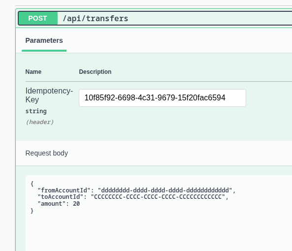

Body Response: 

{

  "transferId": "d18068ce-55bd-4c7e-bd0f-9a696a2b34a9",

  "fromAccountId": "dddddddd-dddd-dddd-dddd-dddddddddddd",

  "toAccountId": "cccccccc-cccc-cccc-cccc-cccccccccccc",

  "amount": 20,

  "createdAt": "2026-01-12T20:24:03.7204497+00:00"

}

### ############### Consultar una cuenta ################# ###

## Flujo ##

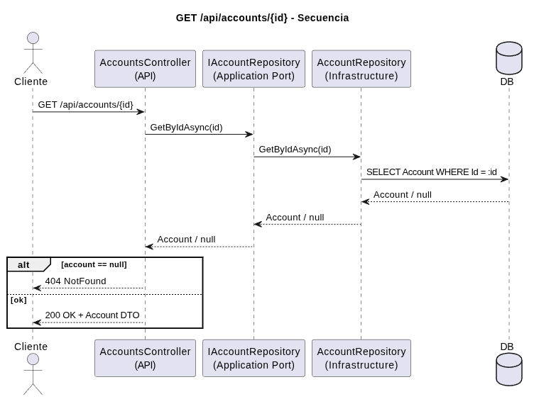

Cargamos el id de una cuenta.

No se puede consultar datos de otras cuentas ajenas al usuario logeado. Respondera un 404. 

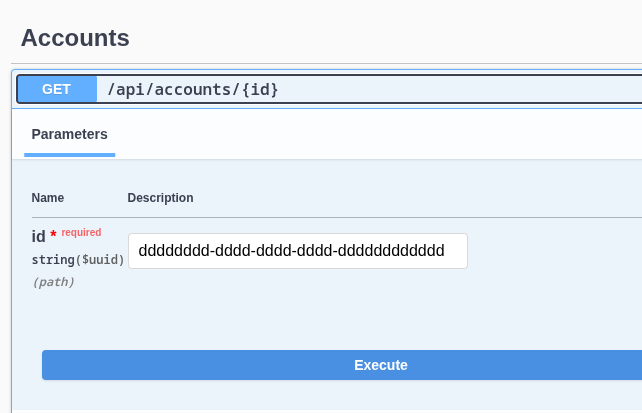

Body Response: 

{

  "name": "Takashi",

  "amount": 250,

  "currency": "PYG"

}

### ############## Consultar el historial de transferencia de una cuenta #################### ###

## Flujo ##

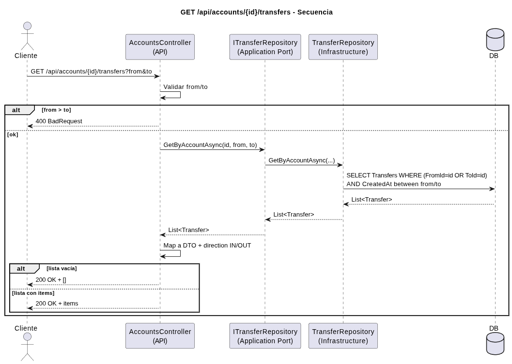

Lo mismo Probamos con algunas de las cuentas de Ids, tampoco podemos consultar cuentas ajenas.

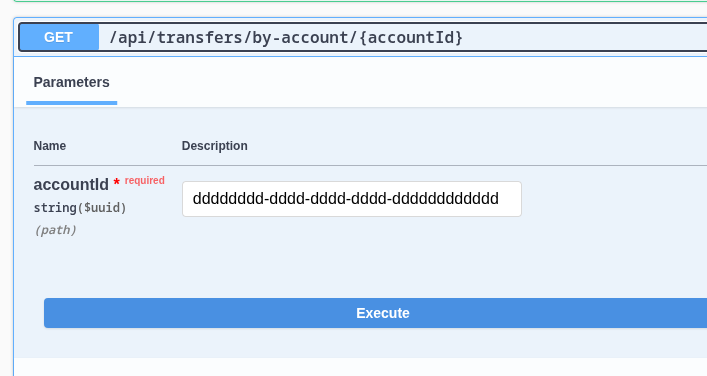

Body Response: 

[

  {

    "id": "b8e64d93-a0b0-4ab7-94d1-aeeb18d5d2ff",

    "fromAccountId": "dddddddd-dddd-dddd-dddd-dddddddddddd",

    "toAccountId": "cccccccc-cccc-cccc-cccc-cccccccccccc",

    "amount": 20,

    "currency": "PYG",

    "createdAt": "2026-01-12T20:59:38.1175869+00:00",

    "direction": "OUT"

  },

  {

    "id": "d979bc2a-556c-42a2-ae15-f56b524b77fe",

    "fromAccountId": "dddddddd-dddd-dddd-dddd-dddddddddddd",

    "toAccountId": "cccccccc-cccc-cccc-cccc-cccccccccccc",

    "amount": 50,

    "currency": "PYG",

    "createdAt": "2026-01-12T20:31:00.3088866+00:00",

    "direction": "OUT"

  },

  {
    "id": "d18068ce-55bd-4c7e-bd0f-9a696a2b34a9",

    "fromAccountId": "dddddddd-dddd-dddd-dddd-dddddddddddd",

    "toAccountId": "cccccccc-cccc-cccc-cccc-cccccccccccc",

    "amount": 20,

    "currency": "PYG",

    "createdAt": "2026-01-12T20:24:03.7204497+00:00",

    "direction": "OUT"

  }

]

### ########### Tambien para probar se puede consultar una lista de cuentas del usuario mismo ####### ###

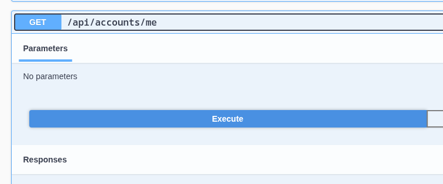

Body Response: 

[

  {

    "id": "dddddddd-dddd-dddd-dddd-dddddddddddd",

    "name": "Takashi",

    "amount": 230,

    "currency": "PYG"

  },

  {

    "id": "eeeeeeee-eeee-eeee-eeee-eeeeeeeeeeee",

    "name": "Takashi",

    "amount": 50,

    "currency": "USD"

  }

]

### -------------- POSTMAN ------------------------- ###

Authenticar token 

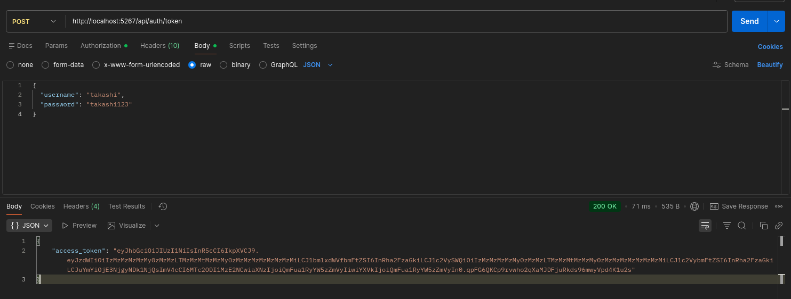

Y cargar el token en todos los servicios en el apartado de Authorization, en Auth Type elegir Bearer Token.

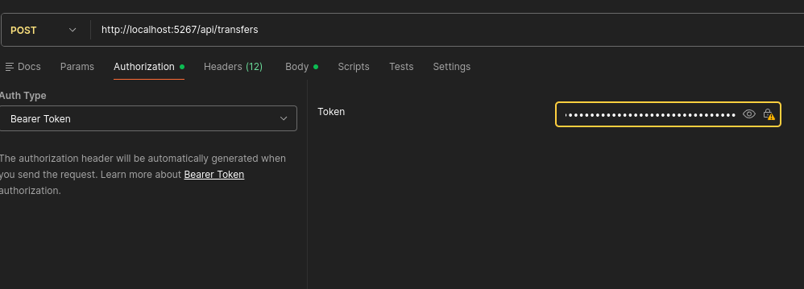

### ### Transferir ### ###
Cargar la idempotencykey 

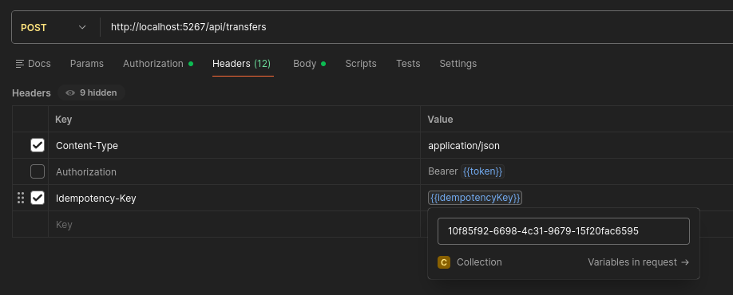

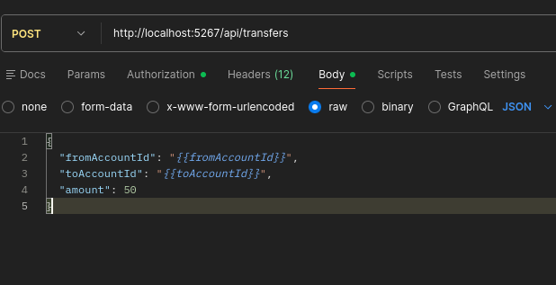
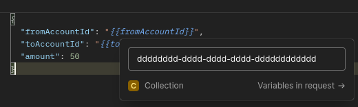

Response: 

### ######### Consultar cuenta ########## ###

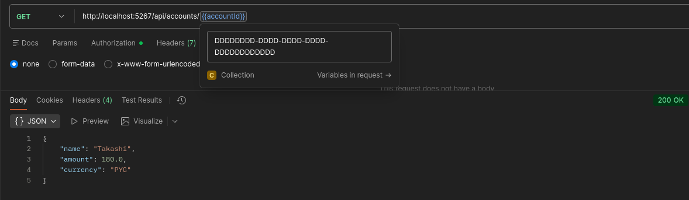

### ######### Historial ############ ###

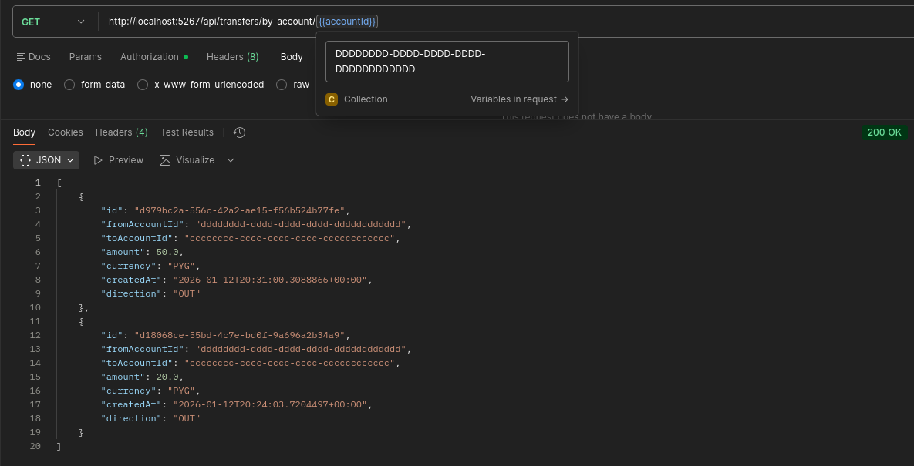